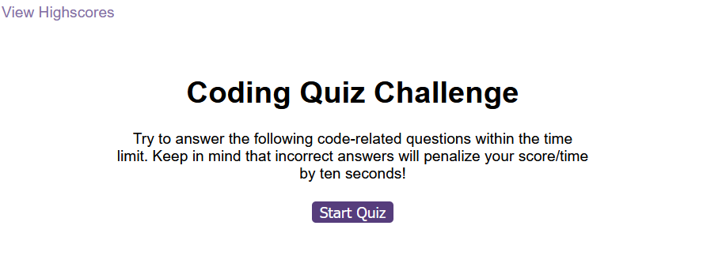

# Fastest Finger Quiz

## Description

This is a quiz application developed using JavaScript, HTML and CSS . The application challeges user to complete the questions based on JavaScript in given tome. Each correct answer adds a score of 1 point to totals. An incorrect anwer deducts 10 seconds from timer. Submit the quiz by entering the user initials and view the score.
The user can retake the quiz an number of times. At the end of submission, the application displays the list of scores recorded at each attempt.

## Table of contents

* [Installation](#installation)
* [Usage](#usage)
    * [Screenshots](#screenshots)
* [Credits](#credits)
* [License](#license)

## Installation

The application is compatible with most commonly used web browsers. 

    

    

## Usage

Below are sample screen shots of the glimpse of the application.

Application landing page

Sample question from the Quiz

Submit Quiz

View highest scores

## Credits

The below references hugely helped understanding concepts about local storage, DOM manipulation in JavaScript, set and clear timer intervals

Local storage : https://laracasts.com/discuss/channels/javascript/append-object-to-localstorage

Quick look for JavaScript concepts : https://www.w3schools.com/

Sort the object values in array : https://developer.mozilla.org/en-US/docs/Web/JavaScript/Reference/Global_Objects/Array/sort

## License

MIT License

